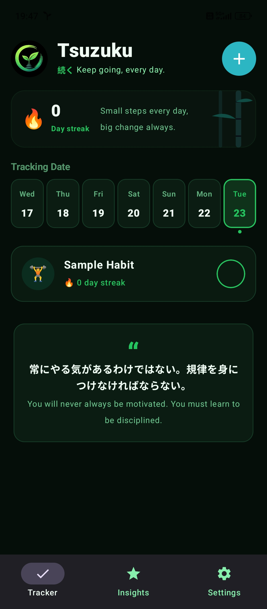
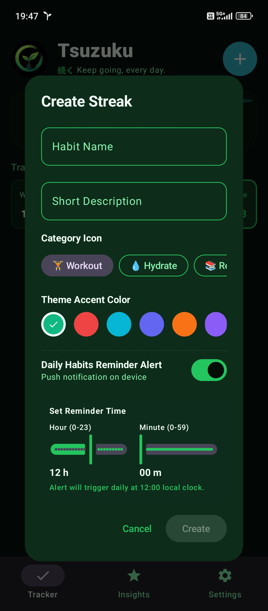
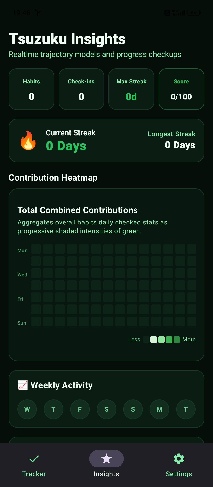
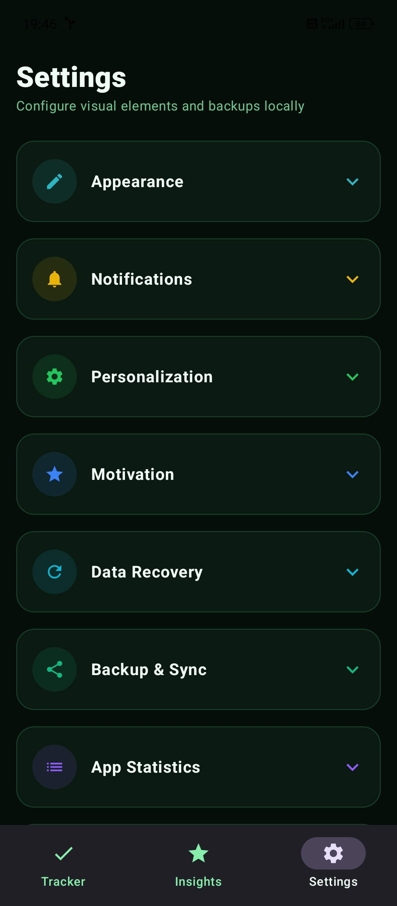
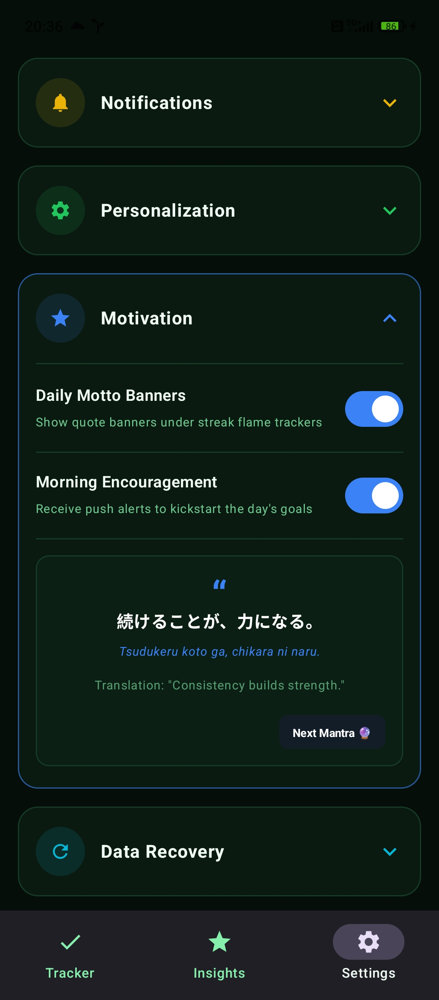
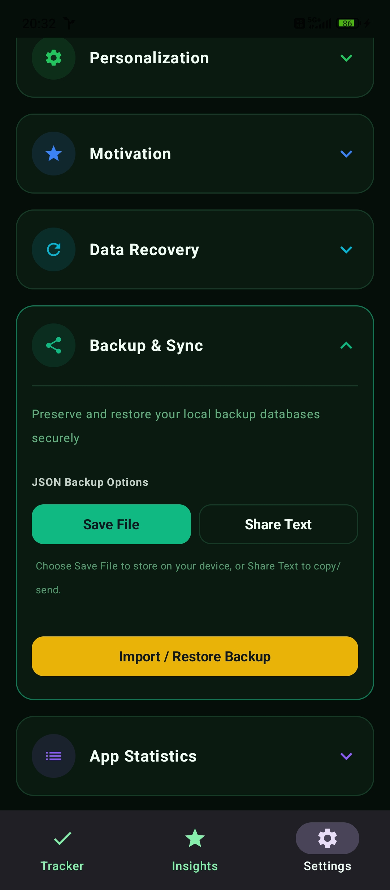
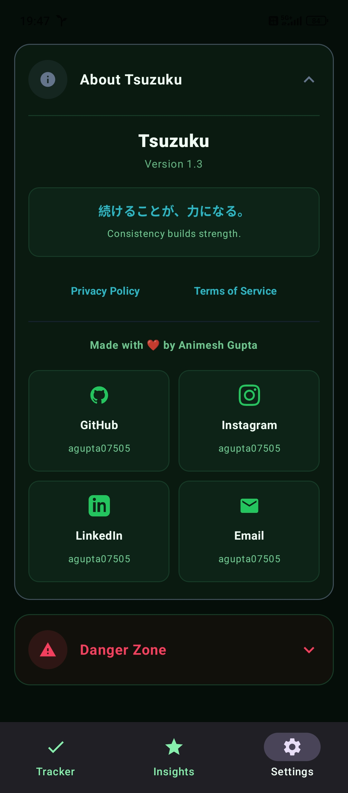
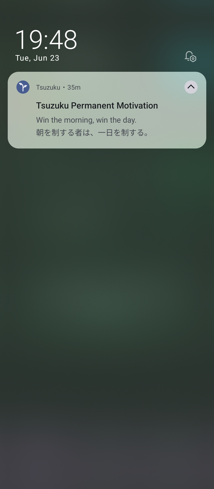

<p align="center">
  
</p>

<h1 align="center">Tsuzuku 🌿</h1>

<p align="center">
  <em>続ける — "to continue" · "to keep going"</em>
</p>

<p align="center">
  <a href="https://github.com/agupta07505/Tsuzuku/releases/latest"></a>
  <a href="https://github.com/agupta07505/Tsuzuku/actions"></a>
  <a href="LICENSE"></a>
  <a href="https://github.com/agupta07505/Tsuzuku/issues"></a>
</p>

<p align="center">
  A beautiful, offline-first, private-by-default habit tracker and streak engine built with Jetpack Compose & Material Design 3.
</p>

---

## 📸 Preview

<p align="center">
  
  
  
  
  
  
  
  
  
</p>

---

## ✨ Key Features

| Feature | Description |
|---------|-------------|
| 🎯 **Streak Tracker** | Plan, log, and maintain daily, weekly, or custom-frequency habits with visual trackers |
| ⚡ **Offline-First** | Zero tracking, zero analytics SDKs, zero cloud — your data stays on your device |
| 🎨 **M3 Themes** | High-contrast dark themes ("Tsuzuku Green" & "Tsuzuku Blue") with Material Design 3 |
| 🔔 **Smart Reminders** | Native low-draw local alarms to check in with your goals on time |
| ✨ **Japanese Mantras** | Ambient bilingual inspiration quotes rendered into notification check-ins |
| 📦 **Data Portability** | Import/export your tracking data locally in standard JSON format |

---

## 📥 Download

<a href="https://github.com/agupta07505/Tsuzuku/releases/latest">
  
</a>

> Grab the latest **signed release APK** or **debug APK** from the [Releases](https://github.com/agupta07505/Tsuzuku/releases) page.

---

## 🛠️ Tech Stack

- **UI Framework**: [Jetpack Compose](https://developer.android.com/compose) — 100% Kotlin, no XML layouts
- **Design Language**: [Material Design 3 (M3)](https://m3.material.io/)
- **Local Persistence**: [Room](https://developer.android.com/training/data-storage/room) — async, state-managed database
- **Themes**: Centralized palettes — Light, Dark, Emerald Green, Deep Aqua Blue
- **Background Tasks**: AlarmManager with custom BroadcastReceivers
- **Networking**: Retrofit + OkHttp + Moshi (for data serialization)
- **CI/CD**: GitHub Actions — automated builds, signing, and releases

---

## 📦 Building from Source

### Prerequisites

- **JDK 17** (Zulu distribution recommended)
- **Android Studio** Ladybug or later (optional, for IDE development)

### Steps

1. **Clone the repository**:
   ```bash
   git clone https://github.com/agupta07505/Tsuzuku.git
   cd Tsuzuku
   ```

2. **Set up environment**:
   ```bash
   cp .env.example .env
   # Edit .env with your Gemini API key (optional for basic usage)
   ```

3. **Make Gradle wrapper executable** (macOS/Linux):
   ```bash
   chmod +x gradlew
   ```

4. **Build the debug APK**:
   ```bash
   ./gradlew assembleDebug
   ```
   Output: `app/build/outputs/apk/debug/app-debug.apk`

---

## 🚀 CI/CD Pipeline

The project uses a fully automated [GitHub Actions workflow](.github/workflows/android.yml) that triggers on pushes to `main`/`master`, tags (`v*`), and pull requests.

**What it does:**
1. Compiles the project with **JDK 17 (Zulu)**
2. Restores or generates debug and release keystores
3. Builds both **Debug** and **Release** APKs
4. Uploads APKs as downloadable build artifacts
5. Creates a **GitHub Release** with signed APKs on `main` pushes and version tags

---

## 🏗️ Project Structure

```
Tsuzuku/
├── app/src/main/java/com/agupta07505/tsuzuku/
│   ├── MainActivity.kt              # App entry point
│   ├── data/                         # Room database, DAOs, entities, Quotes
│   ├── notification/                 # Reminder scheduling & broadcast receivers
│   ├── security/                     # Encryption utilities
│   ├── ui/
│   │   ├── components/               # Reusable Compose components
│   │   ├── screens/                  # TrackerScreen, StatsScreen, SettingsScreen
│   │   └── theme/                    # M3 color palettes & typography
│   └── util/                         # Utility helpers
├── assets/
│   ├── screenshots/                  # App preview images for README
│   ├── banners/                      # Feature graphics & promotional banners
│   └── icons/                        # Additional branding assets
├── .github/
│   ├── workflows/android.yml         # CI/CD pipeline
│   ├── ISSUE_TEMPLATE/               # Bug report & feature request templates
│   └── PULL_REQUEST_TEMPLATE.md      # PR template
```

---

## 💡 Architecture Notes

### Offline-First Mantras

Tsuzuku delivers bilingual inspiration quotes **without any internet API calls**. All 80+ quotes are bundled locally in [`Quotes.kt`](app/src/main/java/com/agupta07505/tsuzuku/data/Quotes.kt):

```kotlin
data class Quote(
    val english: String,
    val japanese: String,
    val romaji: String = ""
)

object Quotes {
    val all: List<Quote> = listOf(
        Quote(
            english = "Consistency builds strength.",
            japanese = "続けることが、力になる。",
            romaji = "Tsudukeru koto ga, chikara ni naru."
        ),
        ...
    )

    fun random(): Quote = all.random()
    fun byIndex(index: Int): Quote = all[index % all.size]
}
```

You can customize these pairs to match your personal goals!

---

## 🤝 Contributing

Contributions are welcome! Please read the [Contributing Guide](CONTRIBUTING.md) before getting started.

- 🐛 [Report a Bug](.github/ISSUE_TEMPLATE/bug_report.md)
- 💡 [Request a Feature](.github/ISSUE_TEMPLATE/feature_request.md)
- 🔒 [Security Policy](SECURITY.md)
- 📜 [Code of Conduct](CODE_OF_CONDUCT.md)

---

## 📄 License

This project is licensed under the **MIT License** — see the [LICENSE](LICENSE) file for details.

---

<p align="center">
  Made with 🌱 by <a href="https://github.com/agupta07505">Animesh Gupta</a>
</p>
