<p align="center">
  
</p>

<h1 align="center">Tsuzuku 🌿</h1>

<p align="center">
  <em>Tsuzuku means "to continue" or "to keep going".</em>
</p>

<p align="center">
  <a href="https://github.com/agupta07505/Tsuzuku/releases/latest"></a>
  <a href="https://github.com/agupta07505/Tsuzuku/actions"></a>
  <a href="LICENSE"></a>
  <a href="https://github.com/agupta07505/Tsuzuku/issues"></a>
</p>

<p align="center">
  A private, offline-first Android habit tracker, focus timer, and minimal launcher built with Kotlin, Jetpack Compose, Material 3, Room, and DataStore.
</p>

---

## 📸 Preview

<p align="center">
  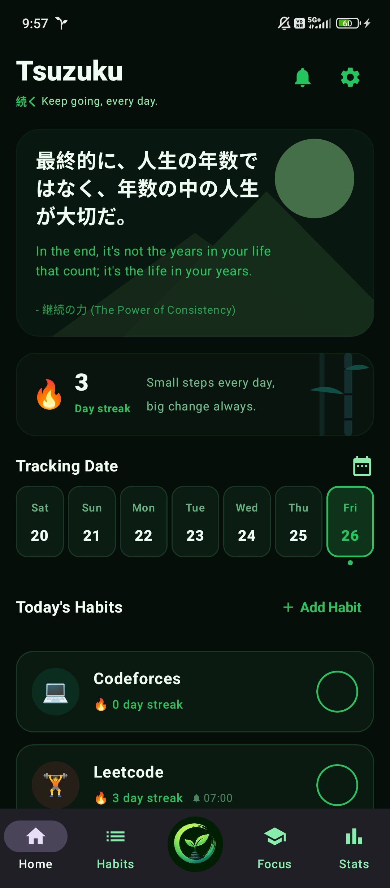
  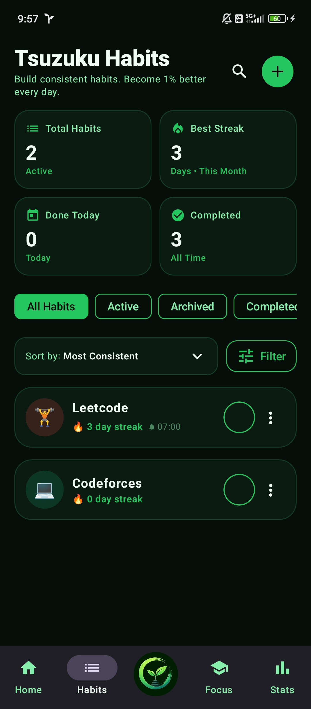
  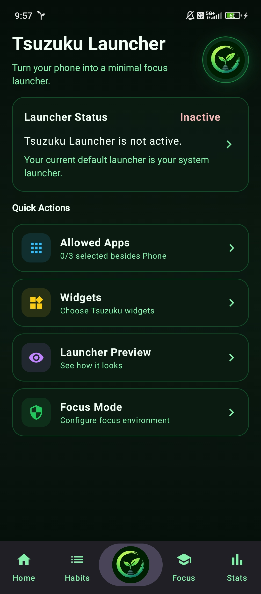
  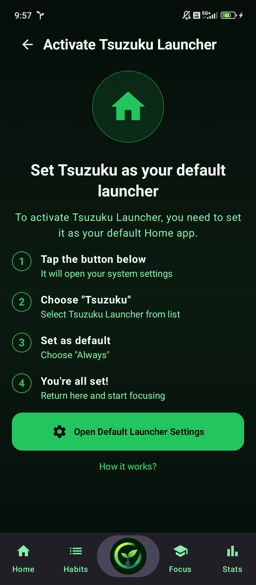
  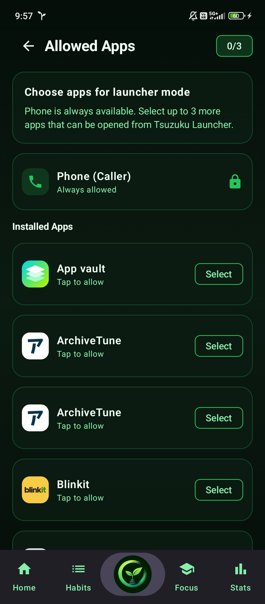
  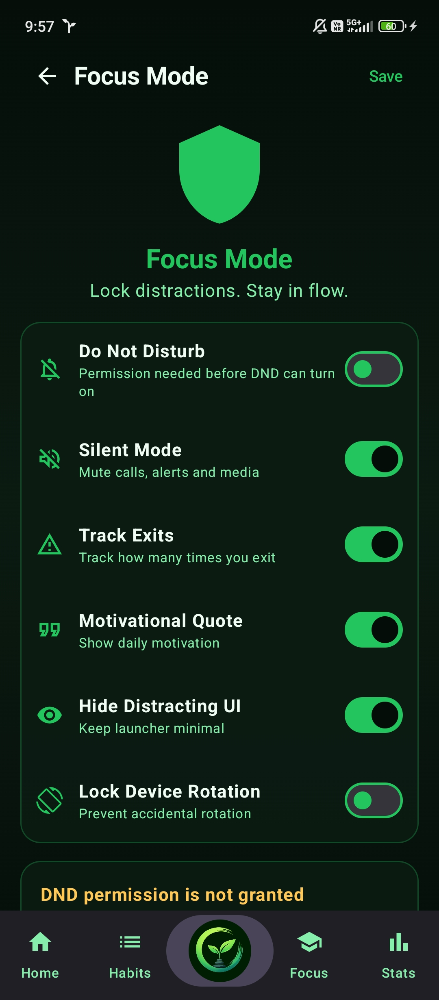
  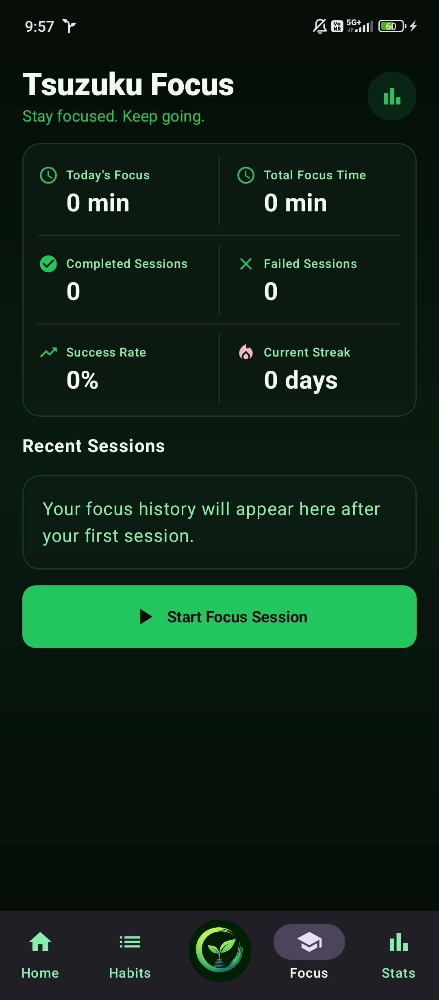
  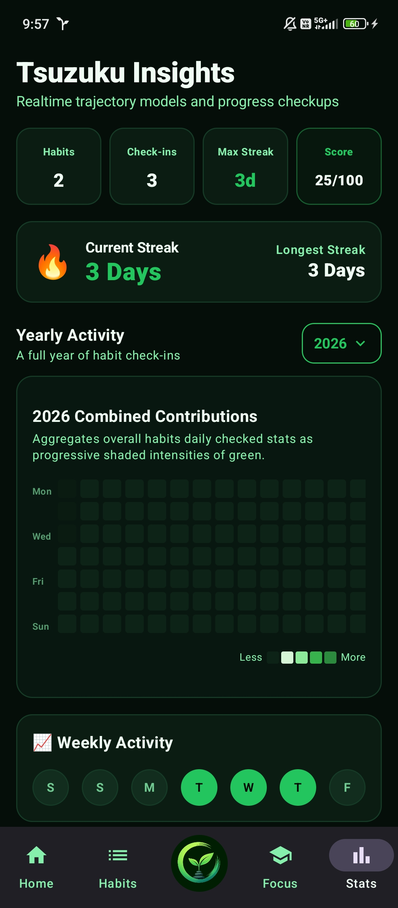
  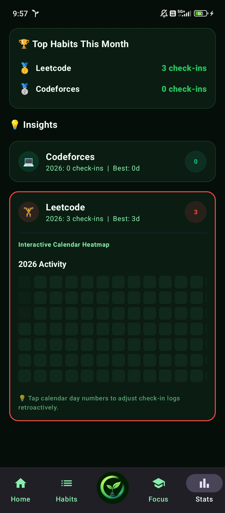
  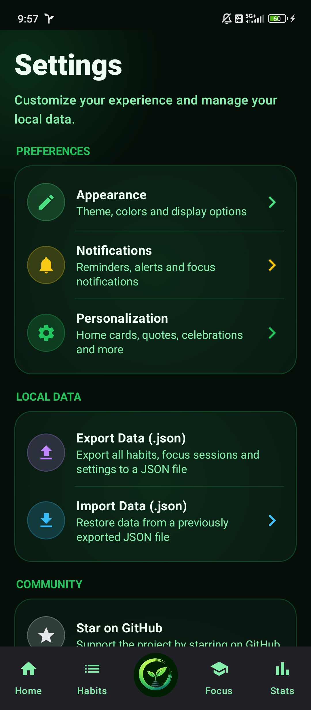
  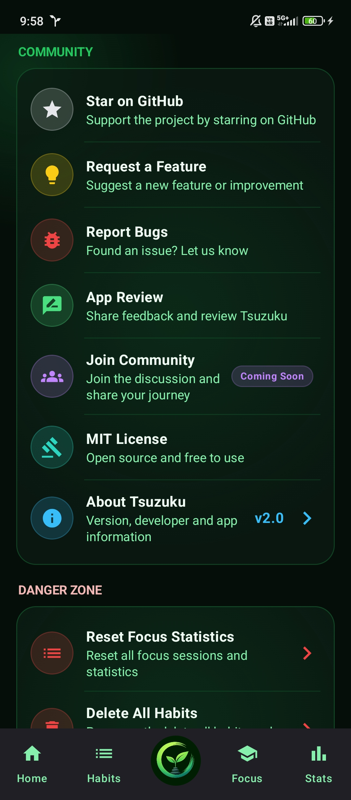
  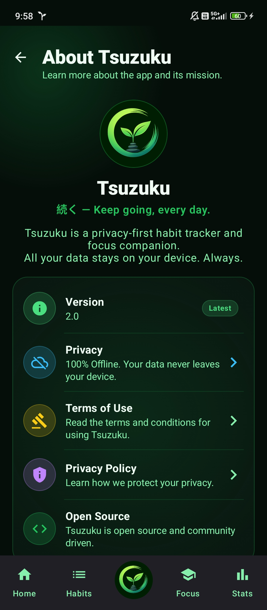
  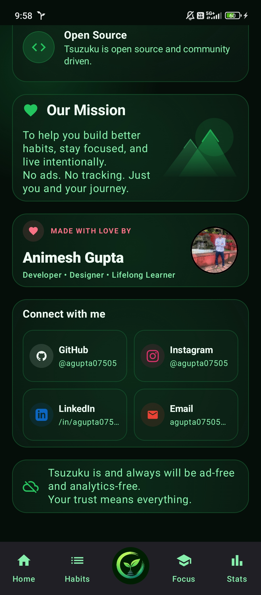
</p>

---

## ✨ Features

| Area | What Tsuzuku does |
|------|-------------------|
| 🎯 Habit tracking | Create habits, add descriptions, pick icons/colors, check in daily, and review active or managed habits. |
| 🔥 Streak engine | Calculates current streaks, best streaks, total completions, and retroactive check-ins from local logs. |
| 📊 Insights | Shows global habit stats, consistency score, weekly activity, top habits, yearly heatmaps, and per-habit calendars. |
| 🧘 Focus mode | Runs timed focus sessions, tracks completed/failed sessions, monitors phone pickup events, supports allowed mistakes, and can use Do Not Disturb. |
| 🏠 Minimal launcher | Optional HOME launcher mode with a clock, quotes, widgets, Phone access, Camera shortcut, and a limited allowed-app list. |
| 🔔 Reminders | Local Android reminders with configurable reminder time and notification permission handling on Android 13+. |
| 💬 Motivation | Bundled bilingual quotes and mantras, available offline in the app and launcher. |
| 🔐 Privacy | Habit names/descriptions are encrypted before storage, and core habit/focus data stays on the device. |
| 📦 Portability | JSON backup and restore for habits, logs, and focus sessions from the Settings screen. |
| 🎨 Personalization | Material 3 themes, custom accent color support, launcher widgets, and focus-environment options. |

---

## 🚀 Future Roadmap

Tsuzuku is growing as a focused productivity ecosystem, not just a habit checklist. The goal is to keep the app calm, private, and useful across the full loop of building habits, protecting attention, and reviewing progress.

| Milestone | Status | Direction |
|-----------|--------|-----------|
| 🌱 Tsuzuku Habits | ✅ Done | Core habit creation, daily check-ins, streak tracking, local reminders, insights, and backup/restore. |
| 🧘 Tsuzuku Focus | ✅ Done | Timed focus sessions with progress tracking, phone-pickup discipline, focus history, and distraction controls. |
| 🏠 Tsuzuku Launcher | 🚧 In progress | A minimal Android launcher that keeps essential apps available while reducing distractions. |
| 🧩 Tsuzuku Widgets | 🗓️ Planned | Lightweight home/launcher widgets for habits, streaks, focus sessions, quotes, and quick check-ins. |
| 🤖 Tsuzuku AI Integration | 🗓️ Planned | Optional assistance for habit ideas, reflection prompts, summaries, and productivity guidance with privacy-first defaults. |
| ✨ More soon | 🔜 Upcoming | More refinements based on real use, feedback, accessibility, and long-term habit-building needs. |

Future work will continue to follow three principles:

- 🔐 Privacy first: user data should stay local unless a feature clearly asks for permission.
- 🎧 Focus over noise: every feature should help users act, reflect, or continue.
- 🛠️ User control: backups, AI features, launcher behavior, reminders, and widgets should remain configurable.

---

## 📥 Download

Download the latest signed APK from the [Releases](https://github.com/agupta07505/Tsuzuku/releases) page.

Development builds from the `dev` branch are published as debug artifacts by GitHub Actions.

---

## 🛠️ Tech Stack

- 💻 Kotlin and Jetpack Compose
- 🎨 Material Design 3
- 🗄️ Room for local habit and focus-session storage
- ⚙️ AndroidX DataStore for launcher preferences
- 🔔 AlarmManager and BroadcastReceiver for local reminders
- ⏱️ Foreground service for active focus sessions
- 📦 Moshi for JSON import/export
- 🧪 Robolectric and Roborazzi for JVM and visual tests
- 🚀 GitHub Actions for debug/release APK builds and releases

Current Android configuration:

| Property | Value |
|----------|-------|
| Application ID | `com.agupta07505.tsuzuku` |
| Version | `2.0` |
| Min SDK | 24 |
| Target SDK | 36 |
| Compile SDK | 36.1 |
| Java target | 11 |

---

## 🧱 Build From Source

### Prerequisites

- JDK 17
- Android Studio Ladybug or later
- Android SDK matching the project compile SDK

### Commands

```bash
git clone https://github.com/agupta07505/Tsuzuku.git
cd Tsuzuku
./gradlew assembleDebug
```

On Windows PowerShell:

```powershell
.\gradlew.bat assembleDebug
```

The debug APK is generated at:

```text
app/build/outputs/apk/debug/app-debug.apk
```

Run unit tests:

```bash
./gradlew testDebugUnitTest
```

---

## 🗂️ Project Structure

```text
Tsuzuku/
|-- app/src/main/java/com/agupta07505/tsuzuku/
|   |-- MainActivity.kt              # Main Compose app and tab routing
|   |-- LauncherActivity.kt          # Optional Android HOME launcher entry
|   |-- data/                        # Room entities, DAOs, repositories, quotes
|   |-- focus/                       # Focus runtime manager and foreground service
|   |-- launcher/                    # Launcher preferences, models, and view model
|   |-- notification/                # Local reminder receiver and helper
|   |-- security/                    # Local encryption helpers
|   |-- ui/
|   |   |-- components/              # Reusable Compose components
|   |   |-- screens/                 # Tracker, habits, stats, focus, launcher, settings
|   |   `-- theme/                   # Material 3 theme and palettes
|   `-- util/                        # Date and streak helpers
|-- assets/
|   |-- screenshots/                 # README and listing screenshots
|   `-- icons/                       # Branding assets
|-- .github/
|   |-- ISSUE_TEMPLATE/              # Bug, feature, and feedback templates
|   |-- workflows/android.yml        # APK build and release workflow
|   `-- PULL_REQUEST_TEMPLATE.md
```

---

## 🔒 Privacy Model

Tsuzuku is designed around local-first use:

- 🗄️ Habit and focus data is stored in the app's local Room database.
- 🔐 Habit names and descriptions are encrypted before being written to storage.
- 🔔 Reminders are scheduled locally through Android system APIs.
- 📦 JSON backup and restore is user-initiated from local files.
- ☁️ The app does not need a cloud account for core habit, focus, or launcher features.
- 🚫 Release signing files, local Gradle properties, generated APKs, personal backups, and other private developer files should never be committed.

Some dependencies for networking or Firebase AI are present in the Gradle catalog for future or optional work, but the current habit tracker and focus workflows are built to function offline.

---

## 🤝 Contributing

Contributions are welcome. Start with the [Contributing Guide](CONTRIBUTING.md), then use the relevant template:

- 🐞 [Report a bug](.github/ISSUE_TEMPLATE/bug_report.md)
- 💡 [Request a feature](.github/ISSUE_TEMPLATE/feature_request.md)
- ⭐ [Share feedback](.github/ISSUE_TEMPLATE/app_review.md)
- 🔒 [Security policy](SECURITY.md)
- 📜 [Code of conduct](CODE_OF_CONDUCT.md)

---

## 📄 License

Tsuzuku is licensed under the [MIT License](LICENSE).

<p align="center">
  Made with ❤️ by <a href="https://github.com/agupta07505">Animesh Gupta</a>.
</p>
